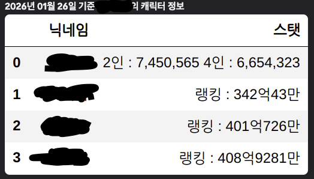

# dnf_discord

던파 캐릭터 정보를 던담에서 수집하고 MongoDB에 저장한 뒤 디스코드 채널에 이미지 형태로 게시하는 프로젝트

참고로 제작자는 던파를 해본적이 없다...

## 작업하는 것

- dundam.xyz에서 특정 계정/캐릭터의 주요 스탯을 주기적으로 수집
- 최신 데이터가 MongoDB에 누적되도록 업데이트
- 디스코드 채널에 계정 단위 요약 이미지를 자동 업로드

## 작업 상세 내용

- Selenium으로 크롤링
- 한글 단위(억/만) 수치 파싱 기능 포함
- MongoDB에 저장
  - 랭킹 항목은 값이 떨어져도 최신 값으로 갱신
  - 나머지 항목은 값이 떨어져도 기존 최대값 유지
- 데이터프레임 → 이미지 변환 후 디스코드 업로드
  - 기존 메세지는 삭제

## 메세지 샘플



## 요구사항

Ubuntu Server 24.04 LTS + Python 3.12에서 정상 작동 확인함

- Python 3.9+
- Google Chrome + chromedriver
- MongoDB
- 메세지 권한 부여한 디스코드 봇

## 설치

```bash
python3 -m venv .venv
source .venv/bin/activate
pip install -r requirements.txt
```

## 설정 방법

### 1) `.env`

`.env.example`에 값을 채우고 `.env`로 파일명 변경

### 2) `config/accounts.json`

config의 example_accounts.json에서 계정명 - 닉네임 쌍을 기입하고 accounts.json으로 파일명 변경

```json
{
  "계정명A": ["닉네임1", "닉네임2"],
  "계정명B": ["닉네임3"]
}
```

## 실행

```bash
python3 DnF.py
```

또는

```bash
python3 -m dnf_discord
```

## 작업 로그 기록

- 저장 위치: `logs/dnf_discord_YYYY-MM-DD.log`

## MongoDB 데이터 구조

- 데이터베이스명 : `dnf_discord`
- 컬렉션명은 계정명으로 지정
- 문서 키: `_id = 닉네임`
- 필드:
  - `ranking` (랭킹)
  - `buff_score` (버프점수)
  - `party2` (2인)
  - `party4` (4인)
